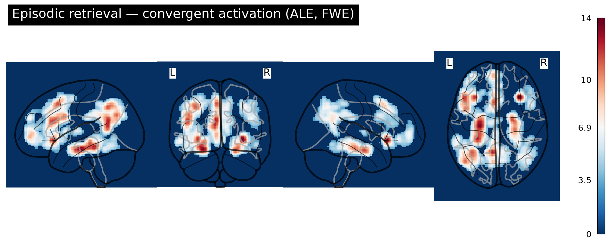
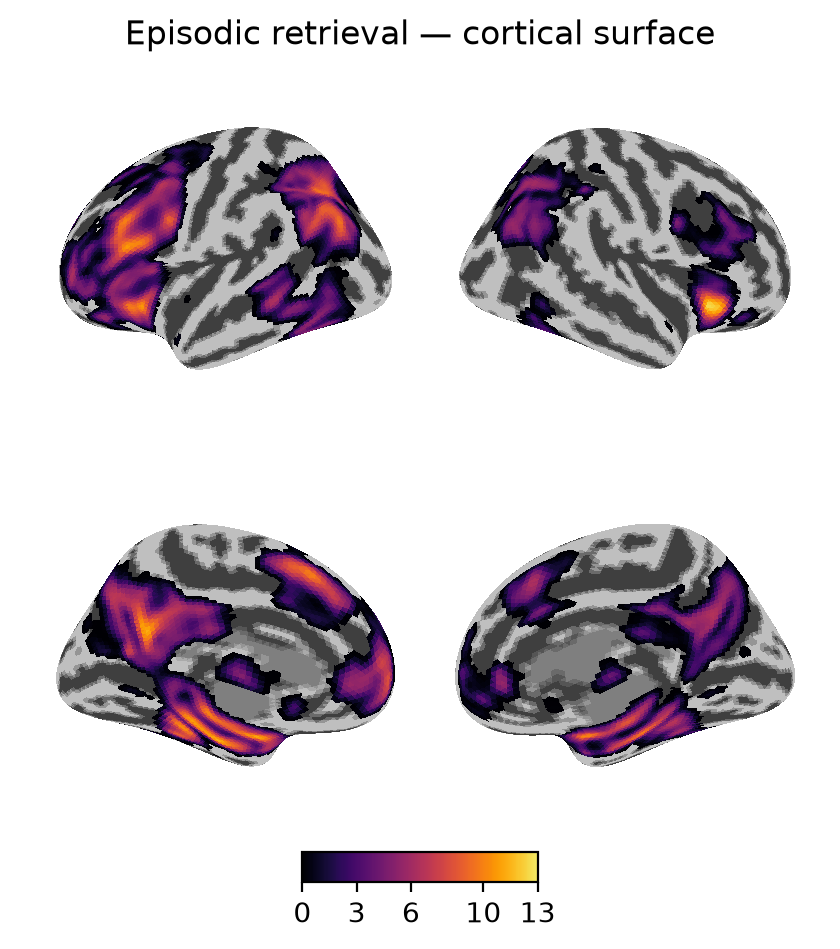
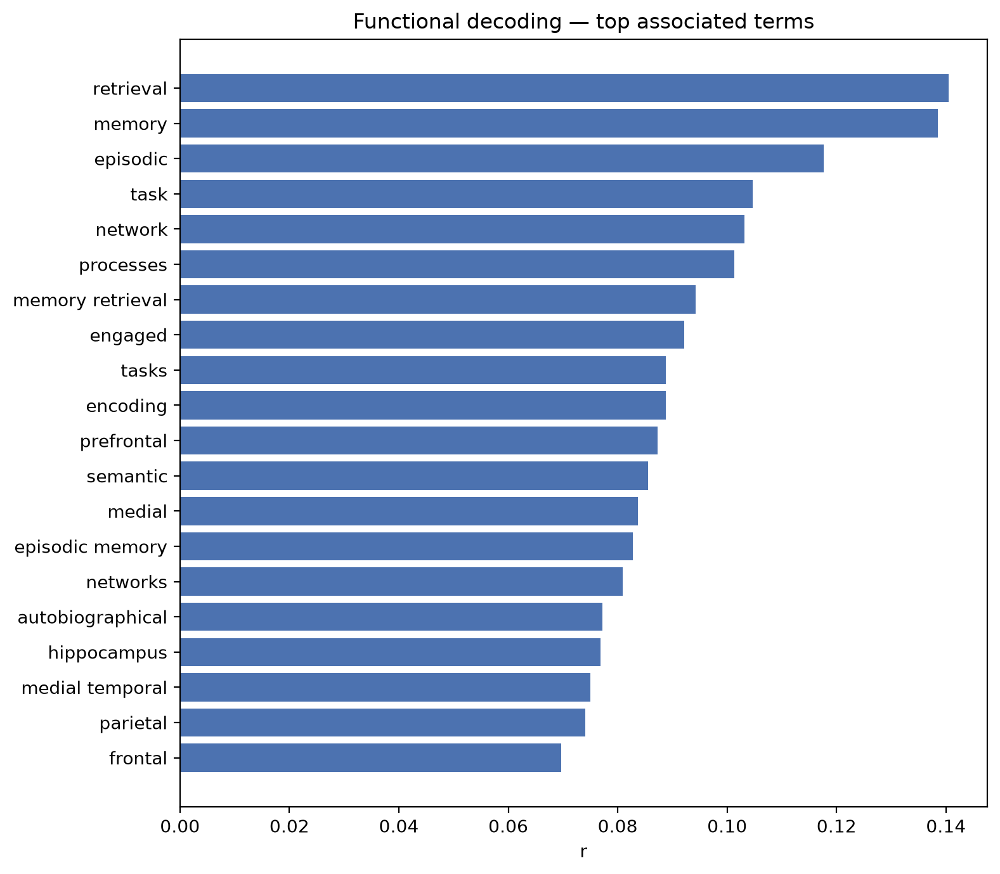
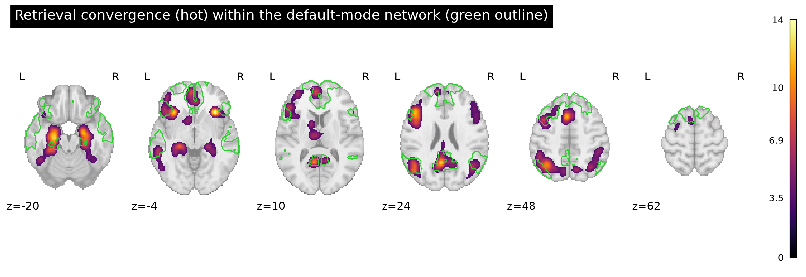
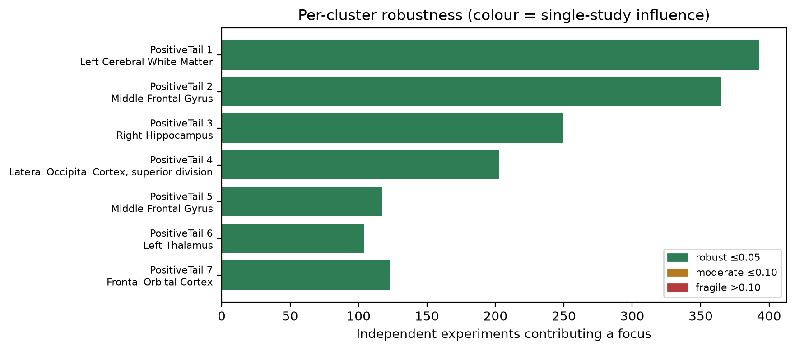
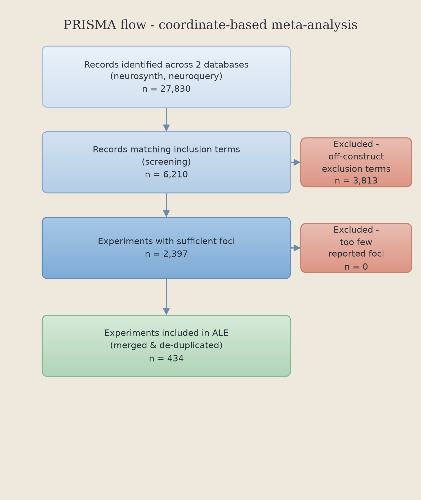

# Coordinate-Based (ALE) Meta-Analysis of Episodic Memory Retrieval

A fully reproducible, coordinate-based **Activation Likelihood Estimation (ALE)**
meta-analysis that synthesises the published fMRI literature on **episodic memory
retrieval** — **434 experiments** pooled from two independent public databases
(Neurosynth + NeuroQuery) with [NiMARE](https://nimare.readthedocs.io), then
extended with connectivity, decoding, and robustness/validation analyses.

### 🔗 Live site: **https://tanishahandoo2002-afk.github.io/ale_meta_analysis/**

*Tanisha Handoo — B.Sc. Neurosciences & Neuropsychology, Amity University.*

---



*Convergent retrieval-related activation across 434 experiments (ALE,
cluster-level FWE). The hippocampus, precuneus/posterior-cingulate, lateral
parietal cortex and medial/lateral prefrontal cortex — the core recollection
network.*

---

## What this is (and isn't)

A **reproducible computational meta-analysis** that recovers the established
episodic-retrieval network from large automated databases, with layered
robustness and validation. It is a high-throughput **complement to — not a
replacement for — a hand-screened systematic review**: it uses text-mined
coordinates and a fixed kernel (the databases don't report per-study sample
sizes), and it confirms rather than overturns the known literature. A
hand-curated, sample-size-weighted ALE is the planned next step
(see [`docs/HAND_CURATION.md`](docs/HAND_CURATION.md) and
[`docs/RESEARCH_ROADMAP.md`](docs/RESEARCH_ROADMAP.md)).

## Key results

| | |
|---|---|
| **434** | experiments (250/database, merged & de-duplicated) |
| **2,000** | Monte-Carlo permutations (cluster-level FWE) |
| **7** | convergent clusters (peak ALE-z up to 13.8) |
| **32%** | of the retrieval map overlaps the default-mode network |
| **7 / 7** | canonical recollection-network landmarks recovered |
| **88% · 73–80%** | replication under a stricter construct · cross-database agreement |

### Convergent regions

| Region (peak) | x | y | z | Peak ALE-z | Size (mm³) |
|---|--:|--:|--:|--:|--:|
| Right anterior insula | 32 | 24 | −4 | 13.8 | 6,360 |
| Left hippocampus (→ precuneus, parahippocampal, parietal) | −24 | −18 | −18 | 13.5 | 90,392 |
| Left orbitofrontal / inferior frontal | −32 | 24 | −4 | 11.9 | 76,168 |
| Right hippocampus | 24 | −10 | −20 | 11.5 | 19,984 |
| Right lateral parietal (angular / LOC) | 36 | −62 | 44 | 7.3 | 15,896 |
| Thalamus / accumbens | −12 | 6 | 8 | 6.3 | 6,440 |
| Right inferior frontal gyrus | 48 | 14 | 30 | 6.1 | 6,968 |

### Cortical surface · Functional decoding

<p align="center">
  
  
</p>

*Left: convergence on the inflated cortex. Right: reverse-inference decoding —
the region is most associated with* retrieval, memory, episodic *across ~14,000
studies, independently confirming its function.*

### Default-mode overlap · Per-cluster robustness

<p align="center">
  
  
</p>

### Study selection (PRISMA)

<p align="center"></p>

## What's included

- **ALE + cluster-level FWE** correction, Harvard–Oxford anatomical labelling
- **MACM** (meta-analytic coactivation modelling) of the strongest hub
- **Functional decoding** (reverse inference against ~14k studies)
- **Dual-process** (recognition vs. recall) and **encoding vs. retrieval** contrasts
- **Default-mode-network overlap** and **landmark recovery** vs. the recollection network
- **Robustness**: jackknife, focus-counter, file-drawer (publication-bias) screen
- **Validation**: stricter-construct sensitivity analysis + cross-database replication
- A **GingerALE/Sleuth export** for independent reproduction

## Reproduce it

```bash
python3.11 -m venv .venv && source .venv/bin/activate
pip install -r requirements.txt

# Full pipeline (bounded, tractable config). Thread caps prevent oversubscription.
OMP_NUM_THREADS=1 OPENBLAS_NUM_THREADS=1 MKL_NUM_THREADS=1 \
NUMEXPR_NUM_THREADS=1 NUMBA_NUM_THREADS=1 VECLIB_MAXIMUM_THREADS=1 \
  PYTHONPATH=src python scripts/run_pipeline.py --config config/config_bounded.yaml
```

Everything is driven by one YAML config; the first run downloads and caches the
databases. Outputs (maps, tables, figures, report) land in `results_bounded/`.

## Repository layout

```
site/                     # static frontend deployed to GitHub Pages
src/ale_meta/             # the pipeline (datasets, curation, ale, diagnostics,
                          #   macm, decoding, contrast, advanced, figures, report)
scripts/                  # run_pipeline.py, publication_extras.py, run_hand_curated.py
config/                   # config.yaml + bounded/publication variants
docs/                     # PROTOCOL, METHODS, GLOSSARY, MANUSCRIPT, HAND_CURATION, RESEARCH_ROADMAP
results_bounded/          # results of the reported run (report, tables, figures)
data/hand_curated/        # template for the hand-curated ALE (next step)
```

## Data provenance & honesty note

Coordinates come from **Neurosynth** and **NeuroQuery**, built by *automated*
text-mining. This makes the analysis reproducible and high-throughput but
broader/noisier than hand-screened inclusion; every number in `results_bounded/`
is computed from real published coordinates by the code here. A 5,000-permutation
full-pool confirmatory run belongs on a cluster/cloud (see the roadmap).

## Key references
Eickhoff et al. (2012, 2016) · Turkeltaub et al. (2012) · Yarkoni et al. (2011,
Neurosynth) · Dockès et al. (2020, NeuroQuery) · Salo et al. (2023, NiMARE) ·
Rugg & Vilberg (2013, recollection network).
